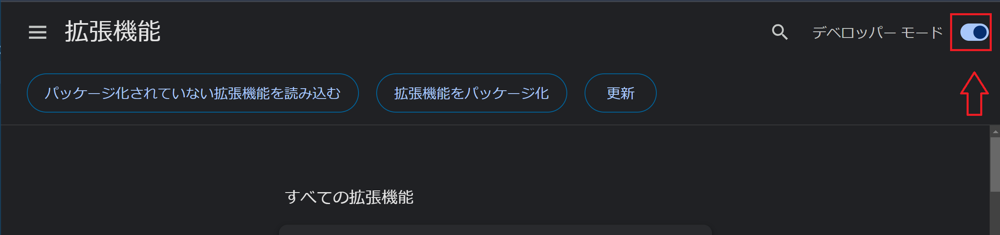
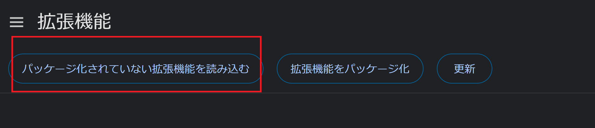

# アマプラのNextupを消すだけのChrome拡張

（chrome以外では動作確認してないけど他でも動くかもしれないです）

## インストール方法

1. 適当なフォルダにこのプロジェクトをコピー

2. chromeのURLバーに chrome://extensions/ と入力して開く

3. 右上の「ディベロッパーモード」トグルをON

4. 「パッケージ化されていない拡張機能を読み込む」を選択

5. 1で用意したフォルダを選択

-----

## 免責
本ソフトウェアの導入や利用によって発生する如何なる問題についても開発元は一切の責任を負いません。 

----
